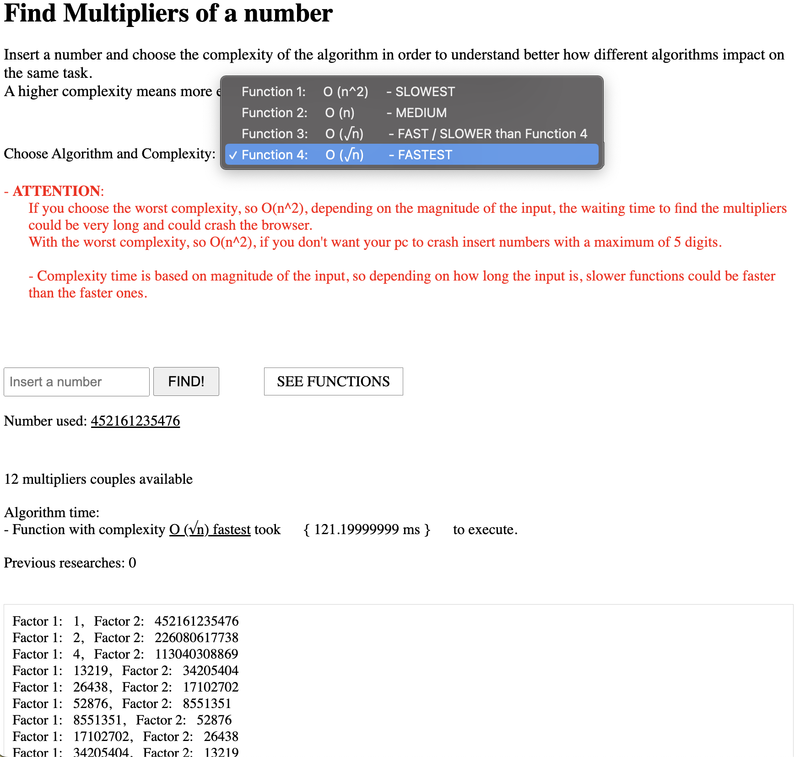

# BigO Notation Multipliers-Algorithm

### Choose the complexity of the algorithm and insert a number to find the multipliers of it.

### Understand better how <u>different algorithms with different time complexities impact on the same task</u>.

 

### - The default complexity is O(√n).

 

-  [Link to functions used](https://github.com/DavideDeLeonardis/BigO-Multipliers-Algorithm/blob/main/js/Multiplicators%20algorithm.mjs)

 
 

-  [See site](https://multiplicator-algorithm.web.app/)

